# 7621 vrf evb 交付说明文档

本机名称：`7621 vrf evb`（board_name `misectel,7621evb`，产品型号 NEX905-F-40）
固件：ImmortalWrt 25.12-SNAPSHOT `r37896-45f33e0f05`
验证方式：Playwright 1.62.1（headless Chromium），HTTPS `192.168.1.1`
验证日期：2026-08-14

本文件说明交付物、Web 管理界面全部配置的 Playwright 实机验证（含配置操作与截图）、
LLDP 邻居模拟验证与功能操作方式。非 Web 测试的配置说明见
[`03-test-config-guide.md`](03-test-config-guide.md)。

## 1. 交付物清单

| 文件 | 说明 |
| --- | --- |
| `00-delivery-boundary.md` | 交付边界（按 SRS 第 4 章逐条标注交付状态） |
| `01-test-report.md` | 测试报告 |
| `02-delivery-instruction.md` | 本文档（交付说明 + Web 验证） |
| `03-test-config-guide.md` | 非 Web 测试配置说明 |
| `testcases/*.md` | 按模块拆分的测试用例（21 个模块文件 + index/all/coverage） |
| `testcases/requirements-testcases.xmind` | XMind 测试用例 |
| `testcases/requirements-testcases.pdf` | 测试用例 PDF |
| `assets/web-test/*.png` | Web 各页面 Playwright 截图（20 张） |
| `assets/web-test/web-test-result.json` | Playwright 机器可读结果 |

## 2. Web 管理界面验证

验证环境：桌面 1440×1000，移动 390×844；登录 `root` / `Admin@12345678`。
Playwright 结果见 `assets/web-test/web-test-result.json`，关键断言（均实际配置设备并回读验证）：

- 登录成功（`login: true`）。
- 主机名经 Web 配置为 `7621 vrf evb`（`web_configure_hostname: true`，board.hostname 回读一致）。
- NAT 映射新增后立即落盘、刷新仍在（`web_configure_nat_mapping_add: true`），删除后消失（`..._delete: true`）。
- IP-MAC 绑定新增后落盘（`web_configure_binding_add: true`），后端 RPC 删除正常（`binding_delete_via_rpc: true`）。
- LLDP 系统名经 Web 配置为 `7621 vrf evb`（`web_configure_lldp_system_name: true`）。
- 首页存在一条非致命 ACL 告警（`uci/get -32002 Access denied`，见 §5）。

### 2.0 功能测试明细（测了哪些功能）

#### Web 配置（Playwright 实机操作并回读）

| # | 页面 | 配置项/功能 | 结果 |
| --- | --- | --- | --- |
| 1 | 登录 | root 账号 HTTPS 登录 | PASS |
| 2 | Overview 首页 | WAN 状态、活动 VRF、NAT 映射数量显示 | PASS |
| 3 | Administration | 主机名 Hostname=7621 vrf evb | PASS（board.hostname 回读一致） |
| 4 | Network（WAN） | WAN 协议/地址/掩码/网关/DNS 配置页 | PASS |
| 5 | VRF NAT | Host 1:1 映射新增→落盘→删除 | PASS |
| 6 | Switch Operations（Ports） | 速率/双工/流控/限速/风暴抑制字段 | PASS |
| 7 | Switch Operations（MAC Security） | MAC 上限/违规动作/允许列表字段 | PASS |
| 8 | Switch Operations（SNMP/LLDP） | LLDP 系统名 System name=7621 vrf evb | PASS（lldp.system_name 回读一致） |
| 9 | ARP & IP-MAC Security | IP-MAC 绑定新增→落盘→RPC 删除 | PASS |
| 10 | System Management | 用户/日志/证书页加载 | PASS |
| 11 | Access Security / Upgrade / System Log | 页面加载 | PASS |
| 12 | 移动端（390×844） | 首页无布局重叠 | PASS |
| 13 | 绑定表格 Edit/Delete 按钮 | 渲染为 [object HTMLDivElement] | FAIL（见 §5） |

#### SNMP 配置（docker net-snmp 实机）

| # | 操作 | 对象/结果 |
| --- | --- | --- |
| 1 | Get | sysObjectID.0=1.3.6.1.4.1.62446.6.1.905.1，sysName.0=7621 vrf evb，sysDescr/Location/Contact 正常 |
| 2 | GetNext/Walk | ENTITY-MIB entPhysicalTable（NEX905-F-40 + wan/lan1-4）、BRIDGE-MIB dot1dBaseBridgeAddress=02 76 21 00 03 E9 |
| 3 | Walk LLDP-MIB | lldpLocSysName=7621 vrf evb，lldpRemSysName=LLDP-TEST-HOST |
| 4 | Set | sysName/sysContact/sysLocation → 成功写入（已修复） |
| 5 | 反向只读 | sysDescr/sysObjectID Set → `noAccess`（保护正确） |
| 6 | SNMPv3 authPriv | SHA-256/AES-256 查询 sysName.0 通过 |
| 7 | 反向错误口令 | 错误 v3 口令 → Authentication failure |

#### LLDP 邻居发现（本机 docker lldpd 模拟）

| # | 检查 | 结果 |
| --- | --- | --- |
| 1 | 设备 Rx 帧计数 | lldpStatsRxPortFramesTotal(wan) 由 0 递增 |
| 2 | LLDP-MIB lldpRemSysName | LLDP-TEST-HOST |
| 3 | get_topology | 返回完整邻居 chassis/port 信息 |

### 2.1 配置设备（本机名称）

进入「System Settings → Administration」，在 Hostname 输入 `7621 vrf evb` 并点击
「Save System Settings」，主机名立即生效并持久化（`board.hostname` 与 SNMP
`sysName.0` 均回读为 `7621 vrf evb`）。


### 2.2 首页（Overview）

登录后进入首页，显示 WAN 状态、活动 VRF、成员端口、路由表与 NAT 映射数量。

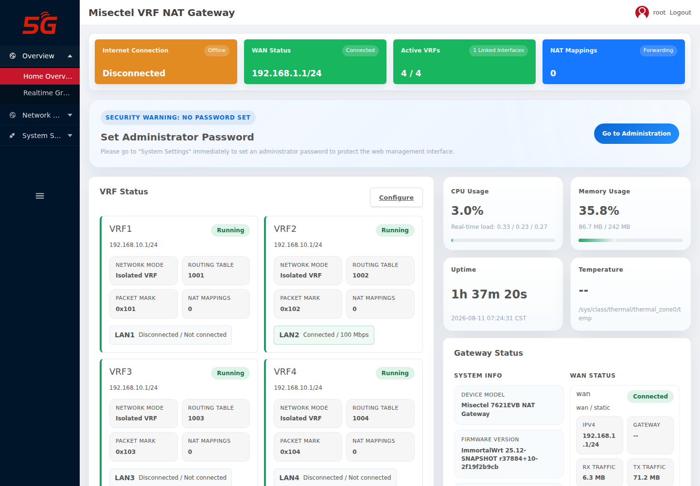

### 2.3 网络（WAN Network）

「Network Settings → Network」配置 WAN 协议（DHCP/静态/PPPoE）、IPv4 地址、掩码、
网关与 DNS，由 netifd 管理。


### 2.4 VRF NAT 总览

「Network Settings → VRF NAT」显示 4 个默认 VRF（vrf1-4，成员 lan1-4）与 NAT 映射列表。


### 2.5 NAT 映射新增 / 删除（Playwright 操作验证）

在「NAT Mappings」卡片点击「Add」打开映射编辑器，支持 Host 1:1 / Subnet 1:1 /
Port Mapping / Multicast Group 1:1 四种类型。


填写 `Name=playwright_test`、`Internal IPv4=192.168.10.101`、`External IPv4=192.168.1.50`
后点击「Save」，配置**立即落盘并刷新**。

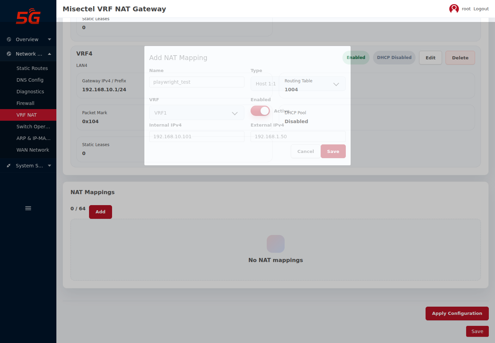


点击「Delete」后映射被移除：

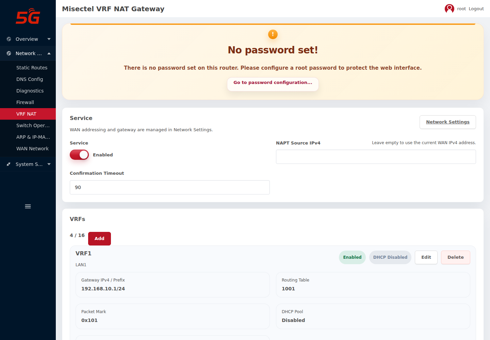

### 2.6 交换运维（Switch Operations）

「Network Settings → Switch Operations」配置端口速率/双工/流控/限速/风暴抑制、MAC 安全、
SNMP/LLDP，并显示端口状态、事件与拓扑。

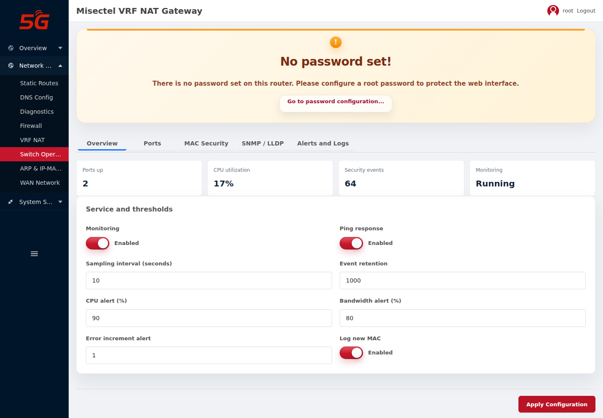

在「SNMP / LLDP」页签下配置 SNMP 代理（版本/社区/v3 口令/位置/联系人）、Trap 与 LLDP
（系统名/描述/接口）。本轮经 Web 将 LLDP「System name」配置为 `7621 vrf evb` 并
「Apply Configuration」后，RPC 回读 `lldp.system_name=7621 vrf evb` 生效。

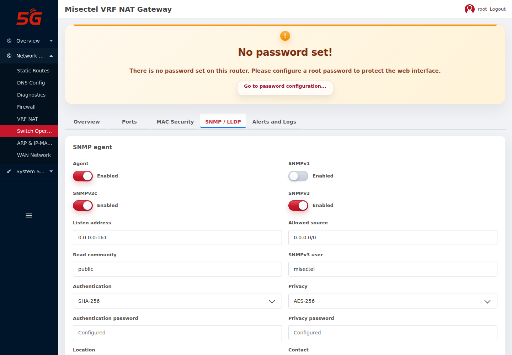

### 2.7 ARP 与 IP-MAC 安全（ARP & IP-MAC Security）

「Network Settings → ARP & IP-MAC Security」配置静态 ARP/IP-MAC 绑定、端口重定向、
DoS/ARP-DHCP 防护。


绑定编辑器（Name / Enabled / VRF / Physical port / IPv4 / MAC / Static ARP /
DHCP reservation / Anti-spoofing binding）：

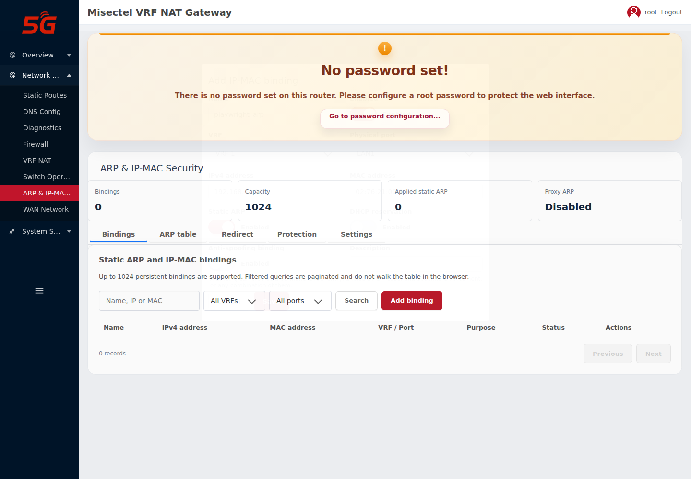

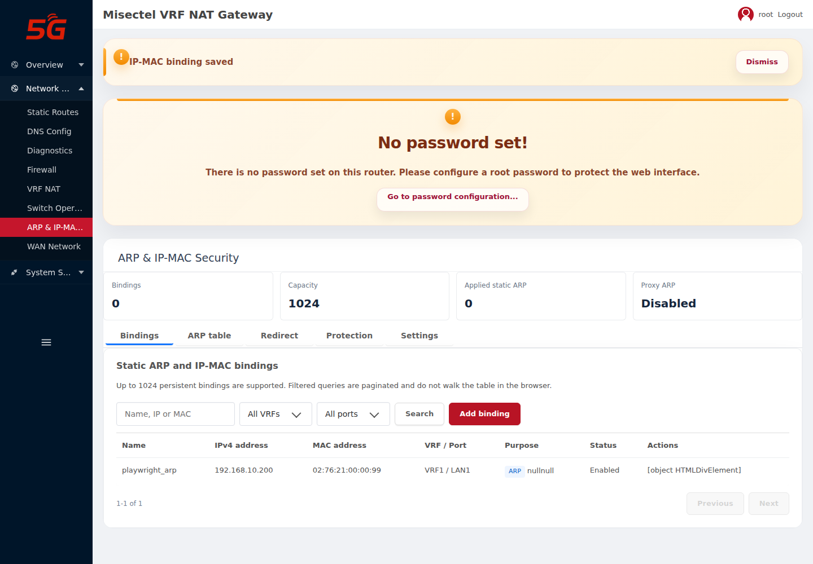

### 2.8 系统管理 / 管理 / 访问安全 / 升级 / 日志

「System Settings」下依次为系统管理、管理（Administration）、访问安全（Access Security）、
升级（Upgrade）与系统日志。


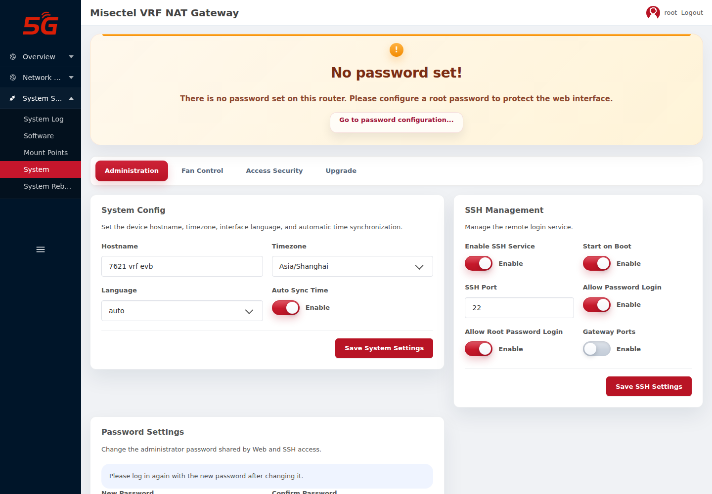

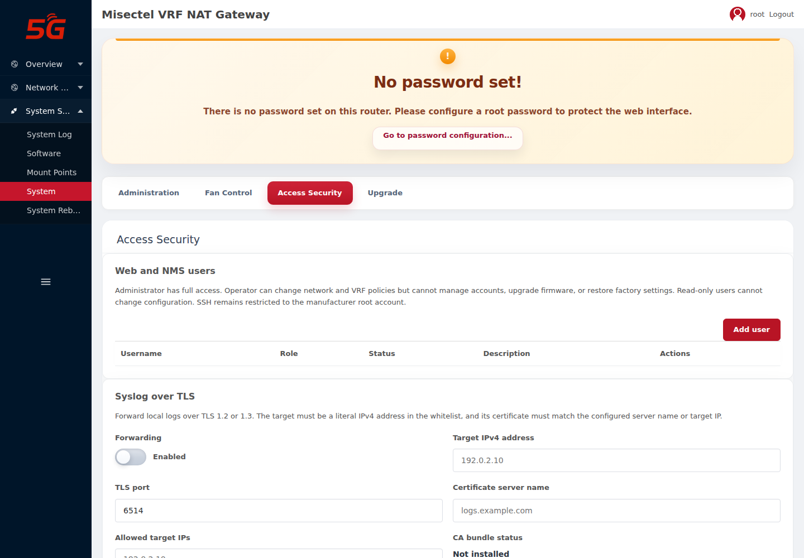

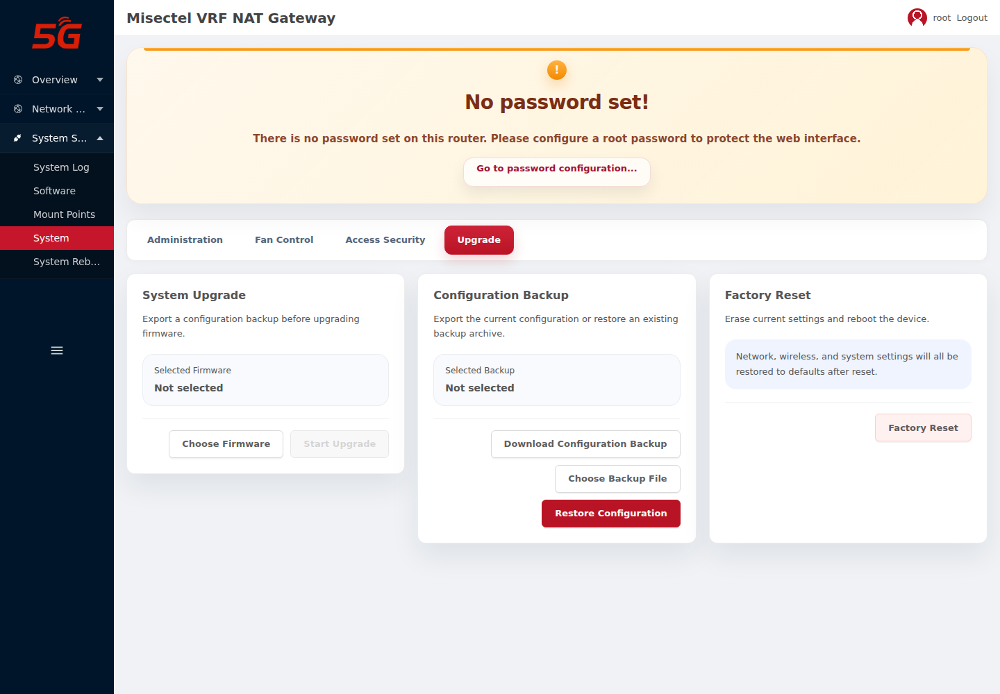

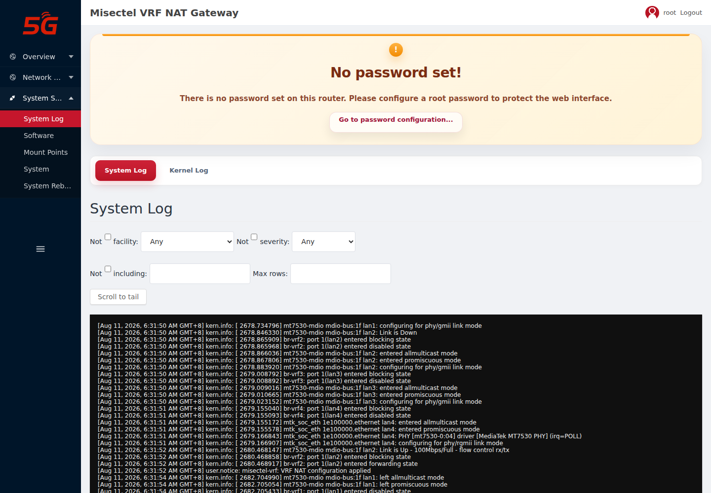

### 2.9 移动端

移动端（390×844）保持相同信息层级，无文字/控件重叠。

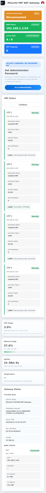

## 2A. LLDP 邻居发现验证（本机 docker 模拟）

为验证 LLDP 邻居发现（SRS 4.9），在本机用 docker 容器运行 `lldpd`（`--network host`
绑定到连接设备 WAN 口的网卡 `enx00e03b83213f`，主机名 `LLDP-TEST-HOST`）向设备发送 LLDP：

```sh
docker run -d --name lldp-sim --network host --hostname LLDP-TEST-HOST \
  --cap-add NET_RAW --cap-add NET_ADMIN \
  alpine:3.22 sh -c "apk add --no-cache lldpd >/dev/null 2>&1; exec lldpd -d -I enx00e03b83213f -c"
```

设备侧验证结果：

| 项 | 结果 |
| --- | --- |
| LLDP Rx 帧计数（WAN，`lldpStatsRxPortFramesTotal`） | 由 0 增至 6 |
| LLDP-MIB `lldpRemSysName` | `LLDP-TEST-HOST` |
| LLDP-MIB `lldpRemPortId`/`lldpRemPortDesc` | `enx00e03b83213f` |
| `misectel.switch get_topology` | 返回完整邻居（chassis/port 信息） |

说明：`lldpd -r` 为「仅接收」模式，会导致设备侧收不到（Rx 计数为 0），模拟发送端须
去掉 `-r`；实际已按此修正并复测通过。

## 3. 关键功能操作说明

- **配置 WAN**：进入「Network」，选择 DHCP/静态/PPPoE，静态模式填写地址、掩码、网关、
  DNS，点「Save & Apply」。
- **配置 VRF 与端口**：进入「VRF NAT」，编辑 VRF 名称、网关前缀、路由表、packet mark 与
  成员端口；一个物理端口不能同时属于两个 VRF。
- **配置 NAT 映射**：「NAT Mappings」→「Add」，选择类型并填写内外地址，点「Save」立即落盘；
  「Apply Configuration」后在确认超时内确认，否则自动回滚。
- **静态 ARP / IP-MAC 绑定**：「ARP & IP-MAC Security」→「Add binding」。
- **SNMP 配置**：「Switch Operations → SNMP / LLDP」配置版本/社区/v3 口令/位置/联系人；
  从 NMS 用 `snmpget/snmpwalk` 查询，`snmpset` 写入三个管理标签（v2c/v3 均可，已修复）。
- **LLDP 配置与发现**：「Switch Operations → SNMP / LLDP」配置系统名/描述/接口；
  邻居发现可用 docker `lldpd` 模拟验证（见 §2A）。
- **固件升级**：「System Settings → Upgrade」上传固件，校验型号与 SHA-256 后确认写入。
- **恢复出厂 / 备份**：「System Settings」下配置备份/恢复与恢复出厂。

## 4. Web 验证结论

| 页面 | 结果 | 说明 |
| --- | --- | --- |
| 登录 | PASS | root HTTPS 登录成功 |
| 首页 | PASS | VRF 网关状态正常显示 |
| Administration（主机名） | PASS | 配置 `7621 vrf evb` 生效并持久化 |
| WAN Network | PASS | 页面正常加载 |
| VRF NAT 总览 | PASS | 4 个 VRF 正确显示 |
| NAT 映射新增/删除 | PASS | Save 后立即落盘、Delete 后移除 |
| 交换运维（含 LLDP 系统名） | PASS | SNMP/LLDP 页签配置并落盘 |
| 安全（绑定新增/删除） | PARTIAL | 新增落盘正常；表格 Edit/Delete 按钮渲染缺陷（见 §5） |
| 系统管理/管理/访问安全/升级/日志 | PASS | 页面正常加载 |
| 移动端 | PASS | 无布局重叠 |

## 5. 已知问题

1. **IP-MAC 绑定表格操作按钮渲染缺陷**：安全页绑定列表的「Edit/Delete」按钮被渲染为
   `[object HTMLDivElement]` 文本（`luci-base-misectel/ui.js` 的 `td()` 对非数组节点执行
   `String()`）。后端 `misectel.security delete_binding` RPC 正常，可通过 RPC 删除。
   截图：`assets/web-test/12-binding-actions-broken.png`。

   

2. **首页 ACL 告警**：`RPC call to uci/get failed with error -32002: Access denied`
   （`luci-app-misectel-dashboard` ACL 仅授 `read`，缺 `uci` 读权限），页面仍正常渲染，
   建议补充 ACL。

3. **NAT 性能未达标**：100Mbps 吞吐与 <1ms 时延未达门槛（见 `01-test-report.md`）。
4. **RTC 无应答**：PCF85063AT 实机 `0x51` 无 ACK（见 `01-test-report.md`）。

## 6. SNMP Set 实现说明

SNMP Set（`sysName/sysContact/sysLocation`）已实现并回归通过：

- 根因：net-snmp `system_mib` 中，snmpd.conf 使用 `sysLocation/sysContact/sysName`
  （非持久）指令时，`system_parse_config_string` 将 `guard` 置为 `-1`，`handle_updates`
  检测 `*set < 0` 即对 SET 返回 `notWritable`，使三个管理标签变为只读。
- 修复：`feeds/packages/net/net-snmp/files/snmpd.init` 的 `snmpd_system_add` 改用
  `psysLocation/psysContact/psysName`（持久）指令，`guard` 置为 `1`，标签保持可写。
- 回归：v2c 与 v3 authPriv 对三标签 Set 成功并回读一致；只读对象 Set 返回 `noAccess`；
  错误口令返回 Authentication failure。详见 `01-test-report.md` §3.3。
