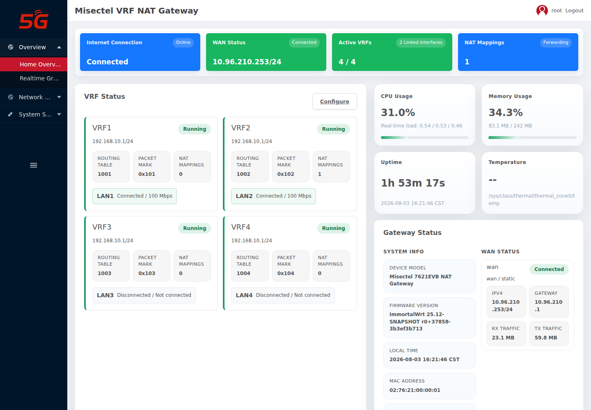
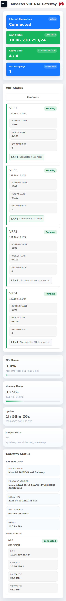
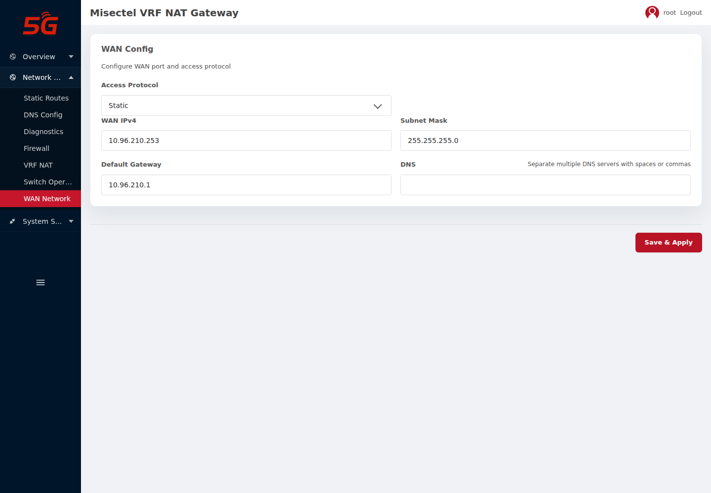
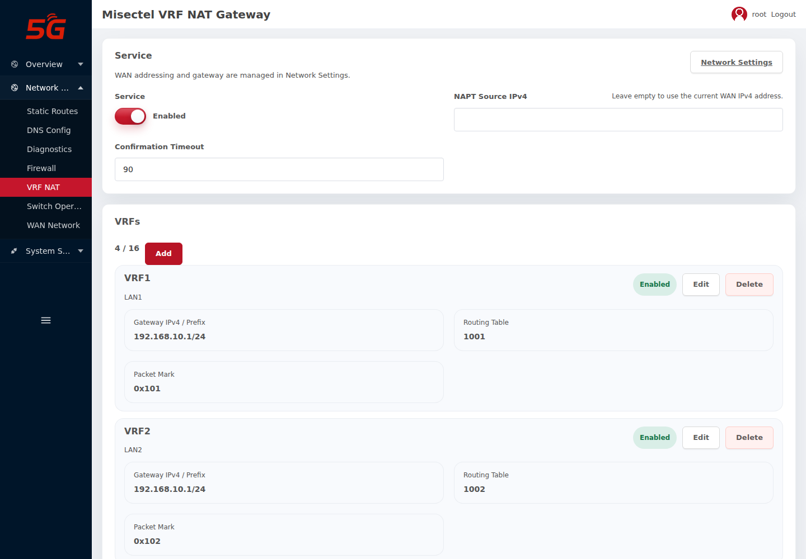
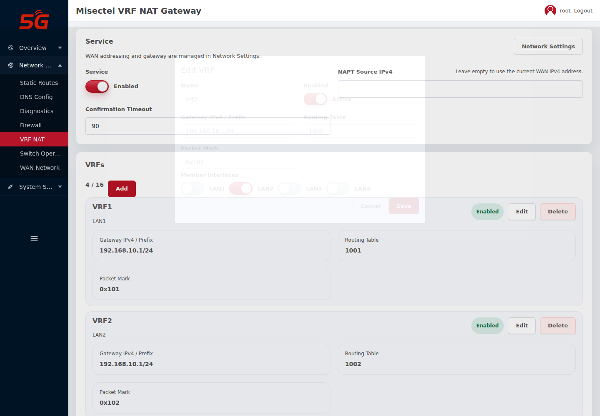
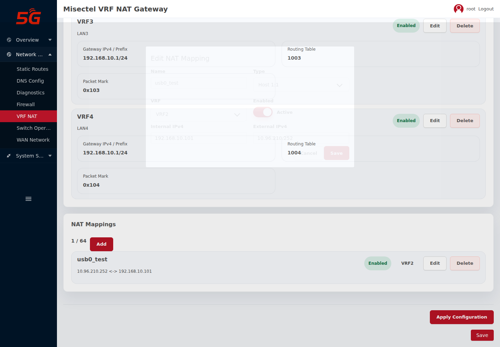

# Misectel 7621EVB VRF NAT 网关交付报告

交付日期：2026-08-03  
设备：`misectel,7621evb`，MT7621，256 MiB DDR3，16 MiB SPI NOR  
软件路径：Linux 软件转发，不启用硬件或软件 flow offload

## 1. 交付范围

本版本交付可启动的 U-Boot、sysupgrade 固件、16 MiB 编程器镜像、Web
管理界面、VRF/NAT 管理后端、交换机运维后端和本文档。WAN 由 OpenWrt
`network.wan`/netifd 管理；LAN1-LAN4 不建立普通 netifd 三层接口，而作为
可分配的物理成员加入独立 VRF。出厂默认将 LAN1-LAN4 分别加入 VRF1-VRF4。

分区布局为：U-Boot `0x000000-0x02ffff`、环境变量 `0x030000-0x03ffff`、
Factory `0x040000-0x04ffff`、WOEM `0x050000-0x05ffff`、LEDEINFO
`0x060000-0x06ffff`、固件 `0x070000-0xffffff`。

交付固件如下：

| 文件 | 大小（字节） | SHA-256 |
| --- | ---: | --- |
| `immortalwrt-ramips-mt7621-misectel_7621evb-u-boot.bin` | 194690 | `5199a4aab34c3a383666992c749d706ecbf98e3d5a03e90252dc12a6061a8654` |
| `immortalwrt-ramips-mt7621-misectel_7621evb-squashfs-sysupgrade.bin` | 11797050 | `d564f18be597e68b23a867ac97a246118ea6b6e3aaeda61a9054f90e4d569c38` |
| `immortalwrt-ramips-mt7621-misectel_7621evb-programmer.bin` | 16777216 | `4156c7a04e76159bde5e6145c9811989bfe3bca88d7aa4201130679cc3c709ba` |

版本号为 `r0+37862-f8ff143f00`。压缩交付包内的 `SHA256SUMS` 可用于
离线核验，写入或升级前必须先确认校验值一致。

## 2. 核心功能与操作指引

### 2.1 首页状态

首页按网关模式显示 WAN、VRF 主设备、成员端口 carrier/速率、路由表、
packet mark 和 NAT 映射数量，不显示蜂窝模组卡片。下图实机中 LAN1、LAN2
为 100 Mbps，LAN3、LAN4 未连接。

移动端保持相同信息层级，不发生文字或控件重叠。

### 2.2 配置 WAN

进入“网络 -> WAN Network”。可选择 DHCP、静态地址或 PPPoE；静态模式
填写 WAN IPv4、掩码、默认网关和 DNS 后点击“Save & Apply”。netifd 负责
地址、默认路由和链路状态，VRF 管理器监听 WAN hotplug 并恢复映射 `/32`
地址、各 VRF 默认路由和 NAT 规则。

### 2.3 配置 VRF 与端口成员

进入“网络 -> VRF NAT”。服务卡片只保留启用状态、NAPT 源地址和确认超时；
WAN 地址不在此页重复配置。每个 VRF 可编辑名称、网关前缀、路由表、packet
mark 和成员端口。一个物理端口不能同时属于两个 VRF。

下图把 LAN2 加入 VRF2。默认配置中四个端口各自位于不同 VRF，因此四个
下联设备可以同时使用相同的 `192.168.10.0/24` 地址空间。

### 2.4 配置 NAT

“NAT Mappings”支持：

- `Host 1:1`：一个外部 IPv4 双向映射到一个 VRF 内部 IPv4。
- `Subnet 1:1`：内外网段前缀长度相同，逐地址保留主机位双向转换。
- `Port 1:N`：按 TCP/UDP 和端口把同一外部地址分配给不同内部服务。
- NAPT：未命中静态映射的出站流量使用当前 WAN IPv4；也可显式指定源地址。

下图为实机验证配置：`10.96.210.252 <-> 192.168.10.101`，选择 VRF2。

网段 NAT 示例：内部 `192.168.10.0/24`、外部 `10.96.211.0/24`、VRF2。
上游路由器还必须配置 `10.96.211.0/24 via 10.96.210.253`；外部网段不能与
WAN 直连网段或其他映射重叠。点击“Apply Configuration”后，在确认超时内
确认配置，否则管理器自动回滚。

## 3. 实机与浏览器验证

- WAN：`10.96.210.253/24`，默认网关 `10.96.210.1`。
- Host 1:1：`10.96.210.252` 到 VRF2 `192.168.10.101`。
- 网络重载后四个 VRF 保持 UP，`.252/32` 自动恢复；VRF2 路由表包含
  `10.96.210.0/24`、`192.168.10.0/24` 和 WAN 默认路由。
- 最终整包升级后，管理地址 `.253` 连续 5 次 ICMP 零丢包，平均
  0.613 ms；映射地址 `.252` 连续 5 次 ICMP 零丢包，平均 0.991 ms，
  HTTP 穿透返回 307。
- Playwright 验证 4 个 VRF、无蜂窝模组标签、桌面/移动端六张截图，页面
  JavaScript 错误为 0。
- 最终 sysupgrade 镜像已分别在实际 VRF 网关和 USB0 下联 MT7621 上通过
  SHA-256 与 `sysupgrade -T` 校验，并完成保留配置升级。两台设备均从 SPI
  NOR 经过 SPL、主 U-Boot 进入 Linux，报告版本
  `r0+37862-f8ff143f00`。
- USB0 下联设备保留 `192.168.10.101/24` 和默认路由，并能经 VRF 网关访问
  本机 `10.96.210.226`。实际网关保留 `.253` WAN、`.252/32` 映射别名、四个
  VRF 及 table 1002 的 WAN 直连路由和默认路由。
- 两台升级时均出现既有的 JFFS2 `Busy inodes after unmount` 警告，但后续
  固件写入、配置追加、重启和 overlay 恢复均成功；该警告未中断本次升级。

## 4. 需求实现矩阵

实现情况：`0` 当前硬件/容量下难以实现或不交付；`1` 当前版本已实现；`2`
需要继续开发或专项实机验收。`1` 不代表 IEC 认证或未列出的性能指标已通过。

| 二级需求 | 初始需求（客户语言） | KANO | 实现情况 | 说明 |
| --- | --- | --- | ---: | --- |
| 标准协议 | IEEE 802.3，10BaseT | 基本需求 | 1 | MT7530/PHY 驱动支持 |
| 标准协议 | IEEE 802.3u，100BaseT(X) | 基本需求 | 1 | 实机 WAN/LAN 协商 100 Mbps |
| 系统启动 | 上电到可 Ping 建议 30 秒内 | 基本需求 | 2 | 已测 38.67/53 秒，未达目标 |
| MAC | MAC 地址表不少于 1K | 基本需求 | 1 | 内核 FDB/交换芯片表查询 |
| MAC | 静态 MAC 配置 | 基本需求 | 1 | 端口静态允许/绑定 |
| MAC | 动静态 MAC 分页查询且不影响业务 | 基本需求 | 1 | 后端分页读取，旁路轮询 |
| MAC | 静态 MAC 绑定端口 | 基本需求 | 1 | 支持 allowlist 和端口绑定 |
| MAC | 动态 MAC 学习 | 基本需求 | 1 | DSA/FDB 自动学习 |
| MAC | MAC 黑名单过滤 | 基本需求 | 1 | 交换运维 ACL 配置 |
| MAC | 每端口 1-64 个 MAC 限制 | 期望需求 | 1 | 告警或行政关断 |
| MAC | 新 MAC 日志或 SNMP Trap | 期望需求 | 1 | 本地事件、Syslog、可选 Trap |
| IP 地址 | Web 配置 IPv4、掩码、网关 | 基本需求 | 1 | WAN Network 页面由 netifd 管理 |
| IP 地址 | NMS 配置 IPv4、掩码、网关 | 期望需求 | 1 | 认证 HTTPS ubus/UCI JSON-RPC |
| IP 地址 | IP-MAC 静态绑定防 ARP 欺骗 | 期望需求 | 2 | 尚无完整 Web 工作流 |
| IP 地址 | IPv4/IPv6 管理 ACL | 期望需求 | 1 | firewall4 页面和规则引擎 |
| DNS | 解析 NTP 服务器域名 | 期望需求 | 1 | 系统解析器支持 |
| DNS | 解析远程日志服务器域名 | 期望需求 | 1 | 系统解析器支持 |
| DNS | 1-2 个静态 IPv4/IPv6 DNS | 期望需求 | 1 | WAN 页面支持列表 |
| DNS | 域名访问管理页并绑定证书 | 期望需求 | 2 | 自签名 HTTPS 已有，域名证书待交付 |
| DNS | 可配置 DNS 缓存 | 期望需求 | 1 | dnsmasq 配置能力 |
| DNS | DDNS | 期望需求 | 2 | 本镜像未集成 DDNS 前端 |
| 系统 WEB | HTTPS/SSH 加密和权限分级 | 基本需求 | 2 | HTTPS/SSH 已有，细粒度用户分级待开发 |
| 系统 WEB | 登录认证/用户管理 | 基本需求 | 1 | 首次强制口令与 root 登录 |
| 系统 WEB | 配置、日志导出 | 基本需求 | 1 | 系统备份和日志导出 |
| 系统 WEB | 设备重启 | 基本需求 | 1 | LuCI 系统操作 |
| 系统 WEB | 恢复出厂设置 | 基本需求 | 1 | LuCI 系统操作 |
| 固件升级 | Web 固件/版本升级 | 基本需求 | 1 | sysupgrade 页面与镜像校验 |
| 固件升级 | 网管平台升级 | 期望需求 | 2 | 网管平台和协议尚未确定 |
| CLI | 厂家调试 CLI | 基本需求 | 1 | BusyBox/OpenWrt shell |
| CLI | SSHv2 加密访问 | 基本需求 | 1 | Dropbear，默认按安全策略关闭/启用 |
| CLI | 备份恢复、批量脚本、实时状态 | 基本需求 | 1 | sysupgrade/ubus/ip/nft/tc 工具 |
| HTTPS/TLS | HTTP/HTTPS | 基本需求 | 1 | HTTP 307 跳转 HTTPS |
| HTTPS/TLS | SSL/TLS | 基本需求 | 1 | uHTTPd OpenSSL |
| HTTPS/TLS | TLS 1.2/1.3 | 基本需求 | 1 | 两个版本均已握手验证 |
| HTTPS/TLS | HTTPS 升级、备份、监控 | 基本需求 | 1 | LuCI 管理面 |
| 日志 | 记录关键事件 | 基本需求 | 1 | logd 与交换机事件环 |
| 日志 | 日志导出 | 基本需求 | 1 | Web 检索和导出 |
| 日志 | Syslog over TLS 和 IP 白名单 | 期望需求 | 2 | 普通远程 Syslog 已有，TLS/白名单待开发 |
| SNMP | v1/v2c/v3 Get/GetNext/Set/BulkGet | 基本需求 | 1 | Net-SNMP；v1/v2c 默认关闭 |
| SNMP | Link/CPU/端口错误 Trap | 期望需求 | 1 | 后端已实现并实机检查配置 |
| SNMP | RFC1213、EtherLike、IF、LLDP MIB | 期望需求 | 1 | SNMPv3 实机查询通过 |
| SNMPv3 | SHA-256/AES-256 | 期望需求 | 1 | authPriv 实机查询通过，不声明 IEC 认证 |
| NTP | 多 NTP 主备和自动切换 | 期望需求 | 1 | 系统 NTP 客户端多服务器 |
| NTP | RTC 失联回退 | 期望需求 | 0 | DTS 已有但当前板 RTC 探测失败 `-145` |
| NTP | MD5/SHA1 密钥认证 | 期望需求 | 2 | 当前客户端未提供对应管理面 |
| NTP | Web 显示锁定、偏移、活动服务器 | 期望需求 | 2 | 需补充状态 API/页面 |
| NTP | RFC 4330/5905 兼容 | 期望需求 | 1 | 系统 SNTP/NTP 客户端能力 |
| NTP | IPv4 SNTP 客户端 | 基本需求 | 1 | 已集成 |
| NTP | 多时间源优先级和备用切换 | 期望需求 | 1 | 多服务器配置，显式优先级仍需专项验收 |
| 管理运维 | 软件看门狗和进程拉起 | 基本需求 | 1 | procd/watchdog |
| 管理运维 | 端口、流量、CPU、内存状态 | 基本需求 | 1 | 首页和交换运维页 |
| 管理运维 | 固件升级 | 基本需求 | 1 | sysupgrade |
| 管理运维 | 配置导入/导出 | 基本需求 | 1 | LuCI 备份恢复 |
| 管理运维 | Ping、Traceroute | 基本需求 | 1 | 诊断页 |
| 端口 | Speed/Duplex/Flow Control | 期望需求 | 1 | 前后端已实现 |
| 端口 | 限速、开关、状态 | 期望需求 | 1 | tc/DSA，实机临时策略验证并恢复 |
| 端口 | 802.3az EEE | 无差异需求 | 0 | 本版本不交付 EEE 配置 |
| 端口 | MTU 配置 | 期望需求 | 2 | VRF 成员端口页面尚未提供 |
| LLDP | 邻居类型、端口、系统信息 | 期望需求 | 1 | lldpd + 页面 |
| LLDP | 网络拓扑图 | 期望需求 | 1 | 前后端已实现，真实邻居专项验收待补 |
| LLDP | IEEE 802.1ab 第三方互通 | 期望需求 | 1 | lldpd 标准实现 |
| LLDP | SNMP 或 Syslog 上报 | 期望需求 | 1 | LLDP-MIB/拓扑变更 Syslog |
| ARP | 静态 ARP 配置 | 基本需求 | 2 | CLI 可用，专用 Web/NMS 接口待开发 |
| ARP | ARP 表查询 | 基本需求 | 1 | 内核邻居表查询 |
| ARP | 最多 1024 条静态 ARP | 基本需求 | 2 | 未完成容量和 Web 验收 |
| ARP | ARP 老化时间 | 基本需求 | 2 | 尚无产品化页面 |
| ARP | Proxy ARP | 基本需求 | 2 | 尚无产品化页面 |
| 路由 | 静态路由不少于 64 条 | 基本需求 | 1 | LuCI/netifd 静态路由 |
| NAT | 1:1、端口 1:N、NAT/NAPT、双向 | 基本需求 | 1 | VRF NAT API/UI v6 |
| NAT | 映射表不少于 64 条 | 基本需求 | 1 | API 限制 64 条 |
| NAT | 组播 NAT、SNAT | 基本需求 | 2 | SNAT 已实现；组播 NAT 尚未完成 |
| NAT | 每秒 15K 包、100 Mbps、延迟小于 1 ms | 基本需求 | 2 | 用户允许不作为门禁，仍需专项压测 |
| NAT | ALG 报文穿透 | 兴奋需求 | 2 | 基础 conntrack helper 可用，完整 ALG 管理/协议验收待补 |
| DHCP | WAN DHCP Client | 基本需求 | 1 | WAN Network 页面支持 |
| DHCP | LAN DHCP Server 跟随内网段 | 基本需求 | 1 | API/UI v6 每 VRF独立地址池、网关、1-2个 DNS 和静态租约；VRF2/LAN2 实机静态租约已验证 |
| ACL | MAC/IP/子网过滤 | 期望需求 | 1 | firewall4 与端口安全后端 |
| ACL | TCP/UDP、ICMP、IGMP 过滤 | 期望需求 | 1 | nftables/firewall4 |
| ACL | Time Range | 期望需求 | 2 | 专用页面和模板待开发 |
| ACL | Permit/Deny/物理端口 Redirect | 期望需求 | 2 | Permit/Deny 已有，物理口 Redirect 待开发 |
| ACL | 工业协议白名单模板 | 期望需求 | 2 | 尚未交付模板库 |
| ACL | 动态 ARP 保护 | 期望需求 | 2 | 需与静态绑定联动开发 |
| ACL | 端口最大 MAC 数量 | 期望需求 | 1 | 已实现 1-64 |
| 安全 MAC | 动态学习数量限制 | 期望需求 | 1 | 告警或行政关断 |
| 安全 MAC | 静态端口/MAC 绑定 | 期望需求 | 1 | allowlist |
| 安全 MAC | MAC 老化时间可调 | 期望需求 | 1 | 交换运维配置 |
| 网络安全 | 广播/多播风暴抑制 | 期望需求 | 1 | 显式 tc ingress policer |
| 网络安全 | DoS/DDoS 防护 | 基本需求 | 2 | 基础防火墙可用，产品化策略和压测待补 |
| 网络安全 | ARP/DHCP 防御 | 期望需求 | 2 | 尚未完整交付 |
| 网络安全 | IEC 62443-4-2 Level 2 | 期望需求 | 0 | 仅可做差距分析，不声明认证 |
| 网络安全 | 防御策略不增加延迟 | 期望需求 | 2 | 默认旁路不挂钩；启用 policer 后需测量 |
| 网络安全 | IP Ping Response 可配 | 期望需求 | 1 | 前后端已验证 |
| 告警统计 | 端口 UP/DOWN 和异常断开 | 期望需求 | 1 | 事件、Syslog、Trap |
| 告警统计 | 带宽和广播/多播阈值 | 期望需求 | 1 | 阈值后端和页面 |
| 告警统计 | CRC、Giant、丢包检测 | 期望需求 | 1 | 计数差值与事件 |
| 告警统计 | 本地/远程 Syslog 归档 | 期望需求 | 1 | 本地环和远程 Syslog |
| 告警统计 | MIB-II/私有 MIB 统计 | 期望需求 | 1 | 标准 MIB 已验证 |
| 告警统计 | 端口安全事件日志 | 期望需求 | 1 | 非法 MAC/溢出/关断记录 |
| 快速诊断 | 端口状态、速率、双工、错误计数 | 期望需求 | 1 | 交换运维实时状态 |
| 快速诊断 | 按时间/类型检索日志 | 期望需求 | 1 | 支持关键词和分页 |
| 快速诊断 | 非法 MAC 安全追踪 | 期望需求 | 1 | 可检索事件链 |

## 5. 已知边界

- 性能目标不作为本次发布门禁；未完成 15K PPS、持续 100 Mbps、CPU/丢包和
  启用防御策略后的延迟测试。
- 当前实机普通重启到 WAN Ping 恢复超过 30 秒。
- RTC 实物线路未工作；NTP 可用但断网后的硬件时钟回退不能验收。
- 编程器镜像中的测试 MAC 不能用于量产；Factory/WOEM/LEDEINFO 未提供的
  区域保持 `0xff`，量产必须写入每台设备的唯一数据。
- 已完成两台设备的保留配置整包升级与热重启回归；仍需进行断电冷启动、
  编程器擦写/回读和长时间稳定性验收。
