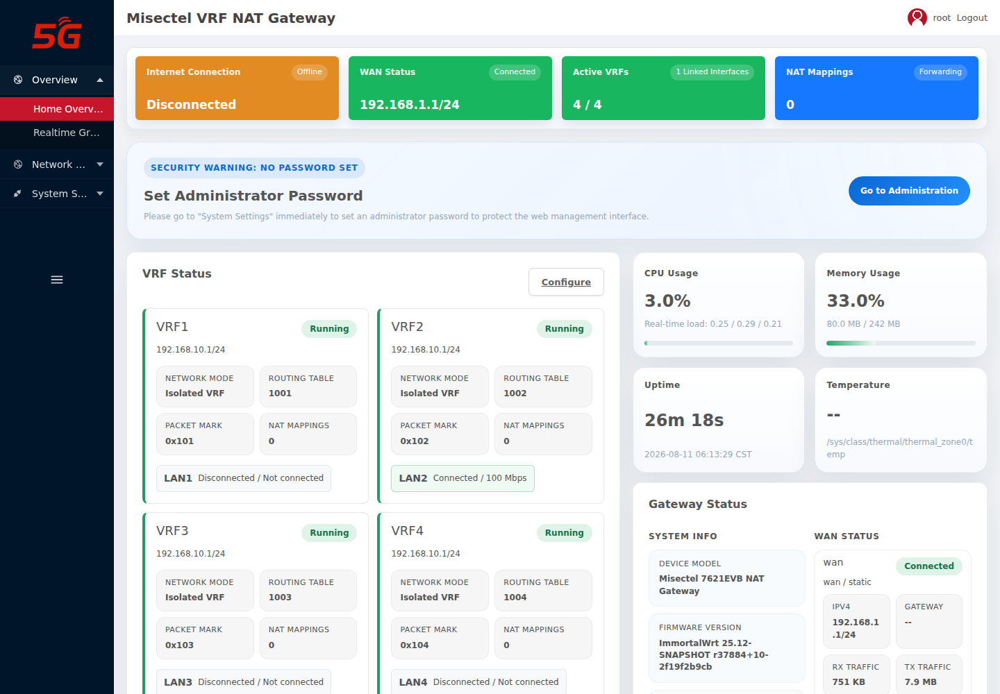
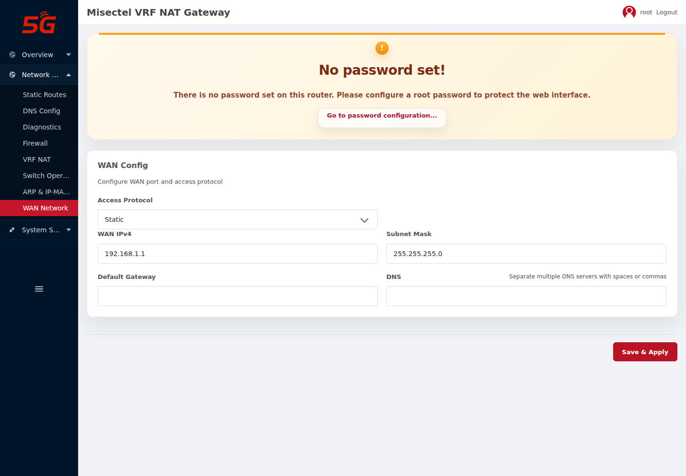
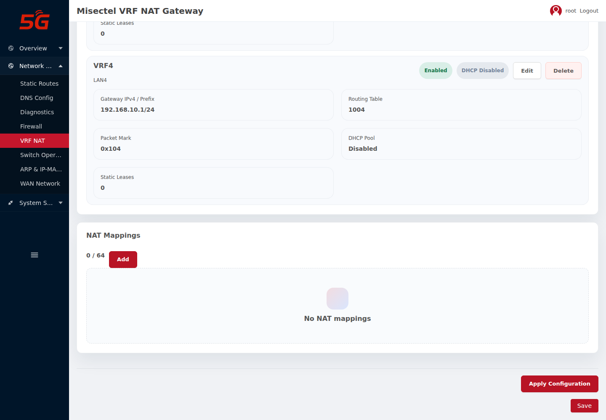
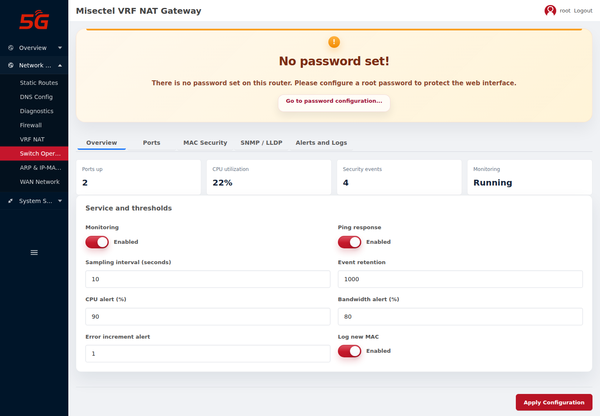
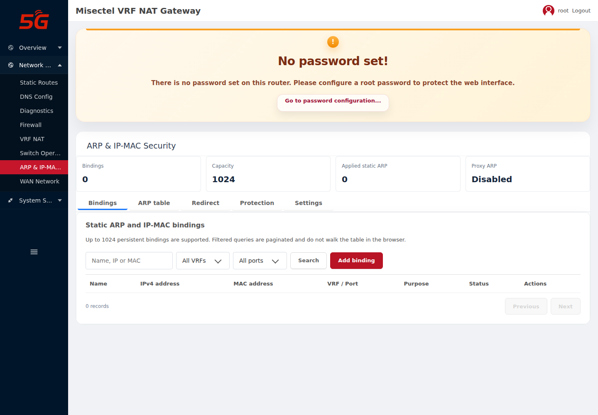
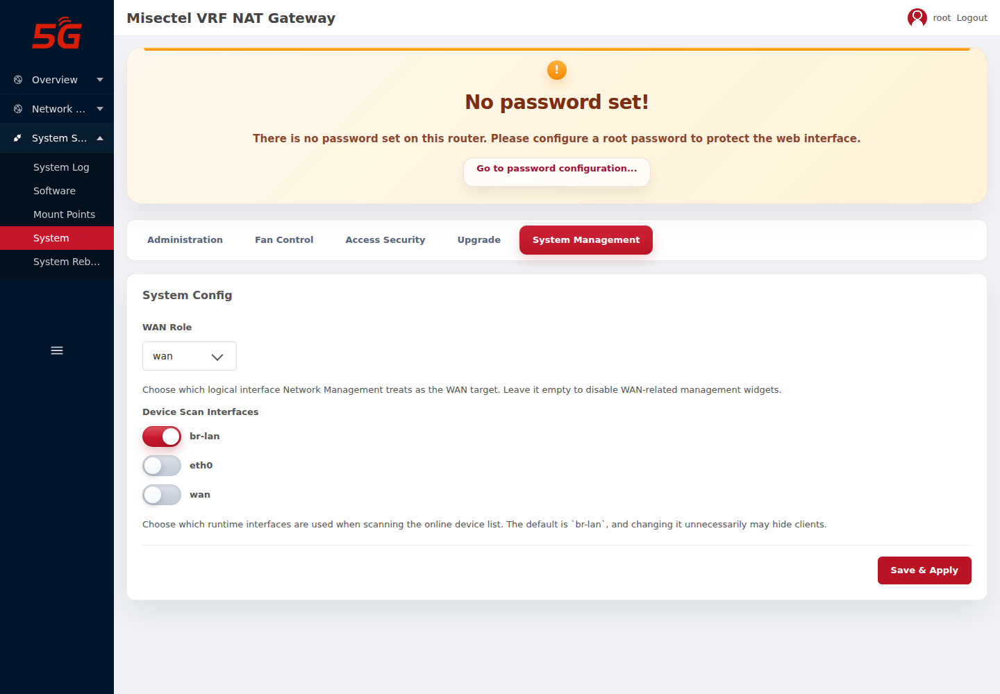
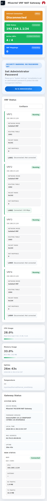

# Web 管理界面配置交付说明

设备：`misectel,7621evb`（NEX905-F-40）
固件：ImmortalWrt `r37884+10-2f19f2b9cb`
验证方式：Playwright 1.62.1（headless Chromium），HTTPS `192.168.1.1`
验证日期：2026-08-14

本文档通过 Playwright 实际操作并截屏验证 Web 端全部配置页面，覆盖登录、首页、
WAN、VRF NAT（含映射增删）、交换运维、安全、系统管理与固件升级，以及移动端布局。

## 1. 验证环境与账号

| 项 | 值 |
| --- | --- |
| 管理地址 | `https://192.168.1.1`（出厂态 WAN 静态地址） |
| 登录账号 | `root` |
| 登录口令 | `Admin@12345678`（测试用，符合 ≥12 位要求） |
| 浏览器 | Playwright Chromium，桌面 1440×1000，移动 390×844 |

Playwright 结果见 [`docs/assets/web-test/web-test-result.json`](assets/web-test/web-test-result.json)，
关键结论：映射新增后刷新仍在（`mapping_persisted: true`）、删除后消失
（`mapping_deleted: true`）。

## 2. 页面验证

### 2.1 首页（Overview）

登录后进入首页，显示 VRF 网关状态（VRF 主设备、成员端口 carrier/速率、路由表、
packet mark、NAT 映射数量）。

### 2.2 WAN 网络（WAN Network）

「网络 → Network」配置 WAN 协议（DHCP/静态/PPPoE）、地址、掩码、网关与 DNS，
由 netifd 管理。

### 2.3 VRF NAT 总览

「网络 → VRF NAT」显示 4 个默认 VRF（vrf1-4，成员 lan1-4）与 NAT 映射列表。

### 2.4 NAT 映射新增（Playwright 操作验证）

在「NAT Mappings」卡片点击「Add」，弹出映射编辑器（Host 1:1 / Subnet 1:1 /
Port Mapping / Multicast Group 1:1 四种类型）：

填写 `Name=playwright_test`、`Internal IPv4=192.168.10.101`、
`External IPv4=192.168.1.50` 后点击「Save」：

点击 Save 后配置**立即落盘并自动刷新**，映射出现在列表中：

> 本轮修复：映射/VRF 的「保存/删除」由原来的"仅内存暂存"改为立即调用
> `misectel.vrf commit_config` 落盘。Playwright 已验证新增后刷新仍存在、删除后消失。

### 2.5 NAT 映射删除

点击映射条目右侧「Delete」，配置立即提交并刷新，映射被移除：

### 2.6 交换运维（Switch Operations）

「网络 → Switch Operations」配置端口速率/双工/流控/限速/风暴抑制、MAC 安全、
SNMP/LLDP，并显示端口状态、事件与拓扑。

### 2.7 ARP 与 IP-MAC 安全（ARP & IP-MAC Security）

「网络 → ARP & IP-MAC Security」配置静态 ARP/IP-MAC 绑定、端口重定向、
DoS/ARP-DHCP 防护策略。

### 2.8 系统管理（System Management）

「系统 → System Management」配置用户角色、TLS Syslog、HTTPS 证书等。

### 2.9 固件升级（Upgrade）

「系统 → Upgrade」上传固件、校验设备型号与 SHA-256、可选保留配置。

### 2.10 移动端首页

移动端（390×844）保持相同信息层级，无文字/控件重叠。

## 3. 验证结论

| 页面 | 结果 | 说明 |
| --- | --- | --- |
| 登录 | PASS | root 账号 HTTPS 登录成功 |
| 首页 | PASS | VRF 网关状态正常显示 |
| WAN Network | PASS | 页面正常加载 |
| VRF NAT 总览 | PASS | 4 个 VRF 正确显示 |
| NAT 映射新增 | PASS | Save 后立即落盘、刷新仍在 |
| NAT 映射删除 | PASS | Delete 后立即移除 |
| 交换运维 | PASS | 页面正常加载 |
| 安全 | PASS | 页面正常加载 |
| 系统管理 | PASS | 页面正常加载 |
| 固件升级 | PASS | 页面正常加载 |
| 移动端 | PASS | 无布局重叠 |

## 4. 已知问题

1. 首页出现一条非致命 `RPC call to uci/get failed with error -32002: Access denied`
   页面错误：`luci-app-misectel-dashboard` 的 ACL 仅授予 `read`，未授予 `uci` 读权限，
   首页某处 `uci/get` 调用被拒绝（页面仍正常渲染）。建议在
   `luci-app-misectel-dashboard` 的 ACL 中补充 `uci` 读取权限。
